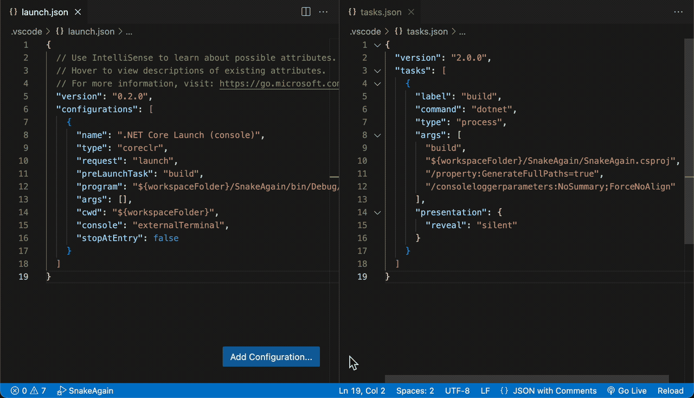

## About
This extension allows you to change active project when Solution contains multiple Projects, also aiming to achieve maximum manual control.

#### How it works
Extension changes `program` property of first launch configuration + second element of `args` in first task, any other properties are left to your discretion.


## Pre-requirements
- Your opened workspace must contain Solution file (.sln) in root directory.
- Your opened workspace must contain `launch.json` and `tasks.json`.
- Your `launch.json` and `tasks.json` must contain at least one launch configuration and build task. (you can generate this setup with default C# extension)

> ```json
> Sample launch.json
> 
> {
>   // Use IntelliSense to learn about possible attributes.
>   // Hover to view descriptions of existing attributes.
>   // For more information, visit: https://go.microsoft.com/fwlink/?linkid=830387
>   "version": "0.2.0",
>   "configurations": [
>     {
>       "name": ".NET Core Launch (console)",
>       "type": "coreclr",
>       "request": "launch",
>       "preLaunchTask": "build",
>       "program": "HERE_WILL_PATH_TO_YOUR_PROJECT_DLL_GO",
>       "args": [],
>       "cwd": "${workspaceFolder}",
>       "console": "externalTerminal",
>       "stopAtEntry": false
>     }
>     // Possibly any other configurations
>   ]
> }
> ```

> ```json
> Sample tasks.json
> 
> {
>   "version": "2.0.0",
>   "tasks": [
>     {
>       "label": "build",
>       "command": "dotnet",
>       "type": "process",
>       "args": [
>         "build",
>         "HERE_WILL_PATH_TO_YOUR_PROJECT_GO",
>         "/property:GenerateFullPaths=true",
>         "/consoleloggerparameters:NoSummary;ForceNoAlign"
>       ],
>       "presentation": {
>         "reveal": "silent"
>       }
>     }
>   ]
> }
> ```